#  Final Project - Mesh Maker

<div align="middle">
        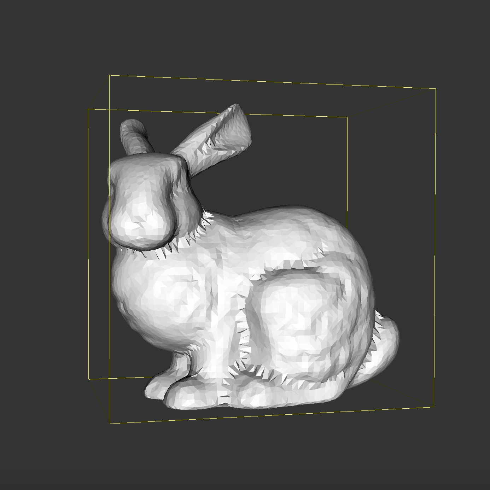
        <figcaption align="middle">bunny.ply using our BPA</figcaption>
</div>

## Abstract

In our project, Mesh Maker, we implemented the Ball-Pivoting Algorithm (BPA) to create a triangle-mesh from a 3D object represented by a point-cloud. In our implementation we referenced multiple research papers on the algorithm such as [The Ball-Pivoting Algorithm for Surface Reconstruction](https://lidarwidgets.com/samples/bpa_tvcg.pdf) and [An Analysis and Implementation of a Parallel Ball Pivoting Algorithm](https://pdfs.semanticscholar.org/8ec0/d70299f83ccb98ad593a1b581deb018cbfe2.pdf). Point-clouds are a common source of output data from 3D scanners, yet lack the surface information and topographical relationships between points found in meshes. Creating an accurate mesh reconstruciton of a point-cloud for rendering and digital modeling is the drive behind implementing a program to create a triangle-mesh from a point-cloud. The Ball-Pivoting Algorithm treats the point cloud $PC$ as a sampling of some manifold surface $MS$. A ball (known as a $p$-ball, for having a radius of $p$) is created such that it would not fall through the surface of the object represented by $PC$. This ball is placed to rest on the mesh on a trio of points, and essentially 'rolls' or 'pivots' across the edges of the reconstructed portion of the mesh to add new triangles as it discovers new points. In the end, when no new triangles can be added by the algorithm, a triangle mesh is output.

## Implementation

#### PCL

We relied on the open-source [Point Cloud Library](http://pointclouds.org) in our implementation. This library allowed us to easily read in point clouds from `.ply` files, estimate surface normals, and display the point-clouds and triangle-meshes in a simple visualizer.

#### BPA Overview

In order to perform surface reconstruction and mesh generation, we've implemented the Ball-Pivoting Algorithm. Broadly, the algorithm works by treating the point cloud $PC$ as a sampling of some manifold surface $MS$. A ball (known as a $p$-ball, for having a radius of $p$) is created such that it would not fall through the surface of the object represented by $PC$. This ball is placed to rest on the mesh on a trio of points, and essentially 'rolls' or 'pivots' across the edges of the reconstructed portion of the mesh to add new triangles as it discovers new points. 

Some important prerequisite processes are required before BPA can begin constructing the mesh. First, the point-cloud must be read from a file into an in-memory data structure. Following the loading of the point-cloud, we must associate surface normals with each point. This informaiton is necessary for ensuring that the $p$-ball remains **on**(above) the surface of the object, and thus is oriented using these surface normals. Lastly, an appropriate $p$ value must be estimated, such that the $p$-ball will not fall through the surface or be too large to create a high-resolution mesh.

An optimization that we've implemented is partitioning the space covered by the points into a 3D-Voxel-Grid. Each Voxel (3D box) is of dimention $2p$x$2p$x$2p$. Now when finding new points to pivot onto, only points that _can_ be pivoted onto are considered. 

##### Visualization Capabilities

An important aspect of our project was the ability to visualize BPA in action. It was important for us to display each component of the algorithm in action. From estimating surface normals, to adding new triangles to the mesh, we made sure to add visualization capabilities to our program.

#### Implementation Pipeline

The process of converting the input point cloud to a triangle-mesh is broken up into various stages, which we arrange into a pipeline:

1. Read in a point-cloud from `.ply` file into an in-memory data structure.
2. Estimate surface normals (for use in BPA).
3. Estimate $p$ value.
4. Partition points in point-cloud into 3D voxel grid for efficient spatial queries.
5. Implement BPA:
   1. Discover a seed-triangle.
   2. Pivot over edges in the `Front`.
6. Output & display triangle-mesh.

### 1) Reading in `.ply` Files

Reading in a `.ply` file can be abstracted away to PCL with ease. There is already a built in class `PLYReader` that can read the points from a `.ply` file into a `PointCloud` data-structure. A `PointCloud` is a collection of points, stored as `PointXYZ` instances. 

```cpp
pcl::PointCloud<pcl::PointXYZ>::Ptr cloud (new pcl::PointCloud<pcl::PointXYZ>);
pcl::PLYReader Reader;
Reader.read(argv[1], *cloud); /* Read in point-cloud of .ply file of argv[1]*/
cloud->width = (int) cloud->points.size ();
cloud->height = 1;
```

With this, we've read in the point clouds into the variable `cloud`.

<div align="middle">
        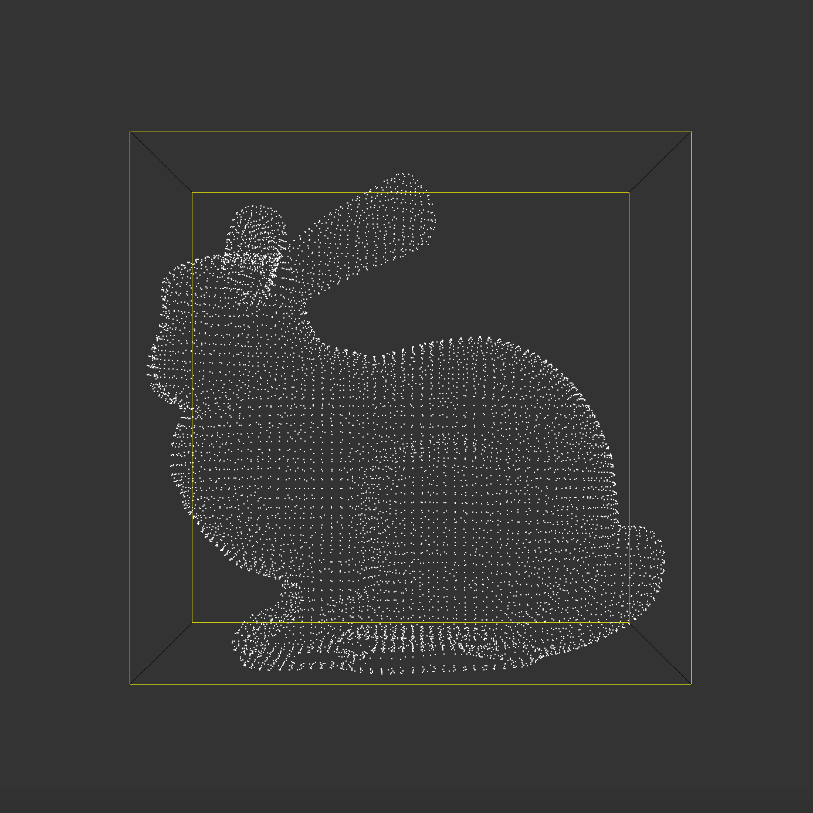
        <figcaption align="middle">point cloud of bunny.ply in visualizer</figcaption>
</div>

### 2) Estimating Surface Normals

Normal estimation can also be mostly abstracted to PCL, as it has a built in `NormalEstimation` class. The way that this normal estimation works is as follows (from the [PCL documentation](http://pointclouds.org/documentation/tutorials/normal_estimation.php)).

1. $k$ neighboring points for the point $p_i$ are found by using a `KDTree`.
2. The normal is that of the plane tangent to the surface definied by the plane fit to the $k$ points.
3. The solution is reduced to performing Principal Component Analysis of the covariance matrix $C$ created below:

$$
C = \frac{1}{k} \sum^k_{i=1} \cdot (p_i - p') \cdot (p_i - p')^T, C \cdot v_j = \lambda_j \cdot v_j, j \in \{0, 1, 2\}
$$

$p'$ represents the 3D centroid of the nearest neighbor, $\lambda_j$ is the $j$th eigenvalue of $C$.

As for the implementation, it's mostly given in the PCL documentation as follows. 

```cpp
pcl::PointCloud<pcl::Normal>::Ptr find_point_cloud_normals(pcl::PointCloud<pcl::PointXYZ>::Ptr point_cloud, double radius) {
  pcl::NormalEstimation<pcl::PointXYZ, pcl::Normal> ne;
  ne.setInputCloud (point_cloud);
  pcl::search::KdTree<pcl::PointXYZ>::Ptr tree (new pcl::search::KdTree<pcl::PointXYZ> ());
  ne.setSearchMethod (tree);
  pcl::PointCloud<pcl::Normal>::Ptr cloud_normals (new pcl::PointCloud<pcl::Normal>);
  ne.setKSearch (radius);
  ne.compute (*cloud_normals);
  return cloud_normals;
}
```

The function returns a `PointCloud` of `Normal`s, which stores information about the direction of the estimated surface normal for each point. These normals are then associated with the point that they belong to, and further are placed into `Vertex` objects with their associated points.

<div align="middle">
      <table style="width=100%">
       <tr>
      <td>
        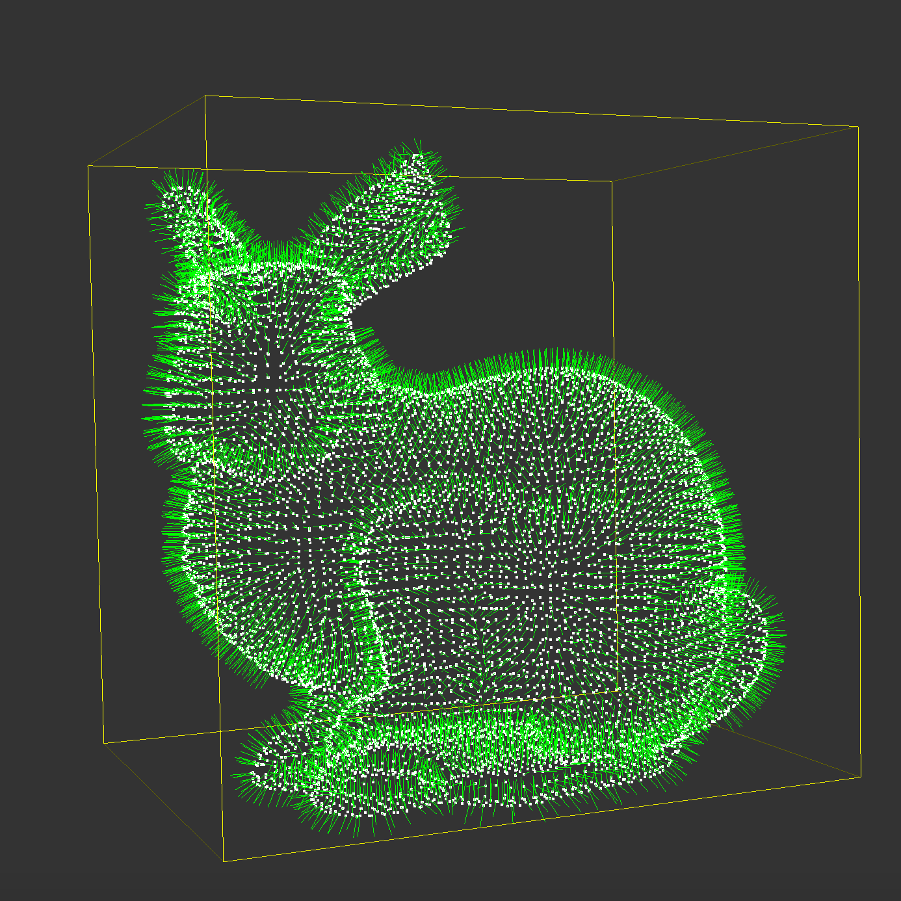
        <figcaption align="middle">point cloud, with normals, of bunny.ply</figcaption>
      </td>
        <td>
        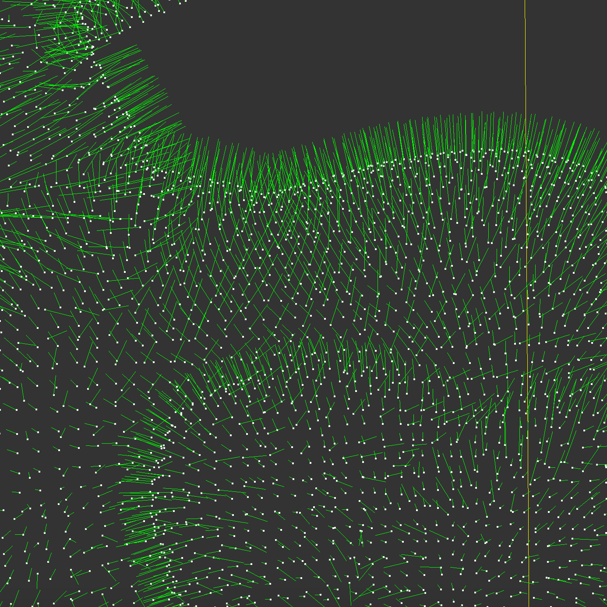
        <figcaption align="middle">point cloud, with normals, of bunny.ply zoomed</figcaption>
      </td>
    </tr>
</table>
</div>

### 3) Estimating $p$ Value for BPA

To estimate the value of $p$, the radius of the ball that will be used in BPA, we want to find a reasonable value of $p$ such that 1. the ball can rest on trios of points without falling through the surface, 2. the ball can pivot over an edge with a high likelyhood of being able to reach another point. To satisfy these requirements, we essentially calculate a value of $p$ that is the average distance of each point to some set number of its neighbors. 
$$
p = \frac{1}{|PC|} \sum_{i = 1}^{|PC|} (\frac{1}{k} \sum_{j = 1}^{k}\text{distance}(p_i, \text{neighbor}(p_i, j)))
$$
A KDTree is used to efficiently look up the $k$ nearest points to $p_i$. The average Euclidian distance between the point $p_i$ and its neighbors is calculated for each point in the point cloud $PC$. Then the average of these distances is found to become the value $p$. 

The number of nearby points considered was somewhat empirically chosen. We found that considering the nearest 16 points worked well for small and medium size meshes. For large meshes, the larger of 16 and 0.01% of the number of points was chosen for a value of $p$, in case the mesh was significantly dense.

### 4) Creating 3D Voxel Grid

To create the 3D `VoxelGrid` we used the PCL `pcl::MomentOfInertiaEstimation` class in order to determine the bounding box of the point cloud. From this, we determine the dimensions of each 3D `Voxel`. In [this paper](https://lidarwidgets.com/samples/bpa_tvcg.pdf) on BPA, the dimensions of each Voxel is chosen as $2p$, 2 times the radius of the $p$-ball. This size is appropriate, because the ball can only pivot to discover points at most $2p$ away from any given starting point. Thus, we fill the bounding box with Voxels of dimension $2p$. The voxels are stored in a width-heigh-depth ordered 1D vector. Each point is added to a Voxel as follows:

```cpp
if (x < num_x && y < num_y && z < num_z && x >= 0 && y >= 0 && z >= 0) {
  	return voxels.at(x * (num_y * num_z) + y * (num_z) + z);
} else {
 		return NULL;
}
```

<div align="middle">
        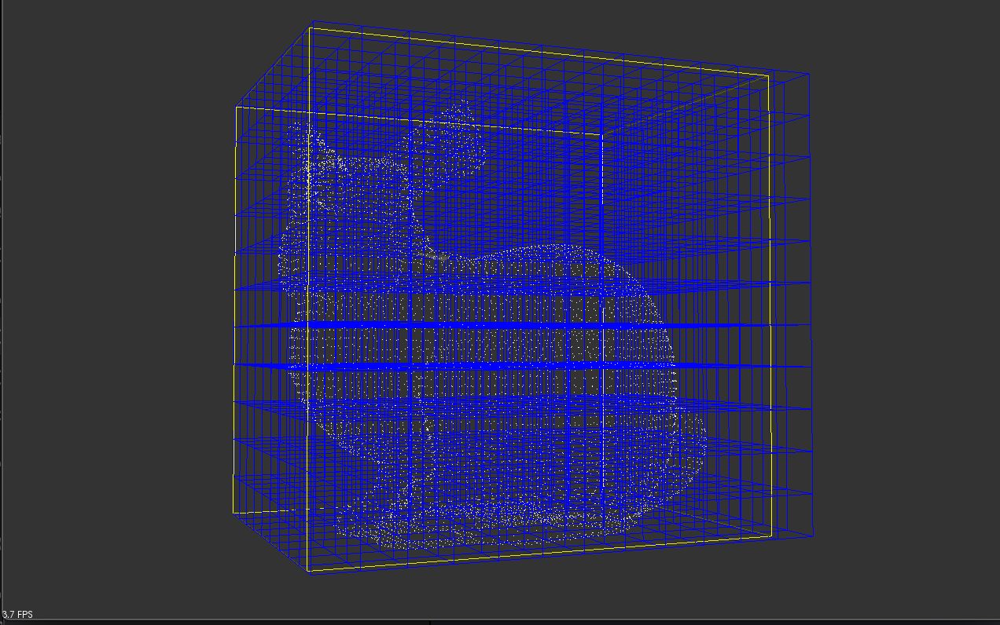
        <figcaption align="middle">3D Voxel Grid for bunny.ply</figcaption>
</div>

### Ball Pivoting Algorithm

With all of the prerequisites performed by our pipeline, we now perform the Ball-Pivoting Algorithm. BPA works generally as follows:

While there are new seed triangles to be found:

1. A seed-triangle is found.
   1. The seed-triangle is added to the mesh.
   2. The seed-triangles edges are added to the Front. 
2. While the front has available edge to pivot over.
   1. An edge is chosen, and it is pivoted over.
   2. If pivoting over an edge creates a trio of points (a new point is found) there might be a new triangle to be added to the mesh.
      1. This new point could create a new triangle if it's not used in the mesh, or if it is part of an edge on the Front.
      2.  Add the triangle made from the edge pivoted over and the point to the mesh, add the edges that make up the new triangle to the mesh.
   3. If pivoting over the edge doesn't unvail a new point, the edge is on the boundary of the mesh.

### 5a) Finding a Seed Triangle

The implementation for finding a seed triangle is in the `seed_triangle` funciton of `main.cpp`. This implementation is outlined by  [this paper on BPA](https://lidarwidgets.com/samples/bpa_tvcg.pdf). All vertices that make up the point cloud and are unused in the mesh are considered.

1. A neighborhood of points that could be reached by a $p$-ball from the vertex, $v$, is found using the `findNeighborhood` function of the `VoxelGrid` class. This funciton finds all points within the 27 voxels surrounding the point.
2. The points in the neighborhood are ordered by increasing distance from the vertex. Then, pairs of vertices, $v_a$ and $v_b$ are considered with $v$ for finding the three vertices that can make up the seed triangle.
3. To represent the $p$-ball that would rest — such that it would not fall through the surface of the object represented by $PC$, its center must be found.

The center of a ball $c$ resting on the three vertices ($v_a, v_b, v$) can be found by:

1. Finding the center of a circle that circumscribes the triangle made up from the three points.
2. Moving the center of the circumscribed circle in the direction of the surface normal vector of the triangle such that it is $p$ away from one of the three vertices.

To find the center and the radius of the circumscribed circle we implemented the Cartesian Coordinates from cross- and dot-products method given three points described [here](https://en.wikipedia.org/wiki/Circumscribed_circle). 

Using the radius of the circumscribed circle, wether or not the $p$-ball rests on the surface can be determined. This can be computed by finding the squared distance of the radius of the $p$-ball and the radius of the circumscribed circle. If this squared distance is larger than 0, then the center of the $p$-ball lies above the surface, and ($v_a, v_b, v$) is a triangle in the mesh.

The outward facing normal of the triangle can be computed as the normalized result of $(v_a - v) \times (v_b - v)$. Then the center of the circumscribed circle is moved in the direction of the outward facing normal by a magnitude of $\sqrt{p^2 - circ\_radius^2}$.

Finally, it must be the case that the $p$-ball resting on the three vertices contains no _other_ vertices. If the $p$-ball contained other vertices, it would **not** be on the surface of the object. This is because, the other vertices in the $p$ ball should be on the surface of the mesh, but if we create a triangle 'below' them, they are no longer on the surface. We use the `contains_no_other_data_points` function to iterate through the points in the neighborhood to determine that there are no other points other than ($v_a, v_b, v$) within the $p$-ball.

 Now the triangle is added to the mesh, and each of its edges are added to the front the center of the ball that rests on that edge, $c$, is chosen as described above.

### 5b) Pivoting Over Edges on the Front to Discover New Triangles

Once a seed-triangle has been discovered, there are edges added to the front. The $p$-ball resting on the triangle that each edge is a part of is described by its center. The algorithm for pivoting the ball is modeled from these papers: [[1]](https://lidarwidgets.com/samples/bpa_tvcg.pdf) and [[2]](https://pdfs.semanticscholar.org/8ec0/d70299f83ccb98ad593a1b581deb018cbfe2.pdf). Paper [1] was used to determine which edge to pivot over, paper [2] was used to acutally pivot over an edge. This is because paper [1] did not contain a concrete, comprehendable procedure for pivoting, while paper [2] laid out a concrete impelmentation. 

##### Finding an Active Edge

On deviation of our algorithm from the algorithm laid forth in the papers is that our Front contains all edges that have been discovered by the algorithm; not just those that can be pivoted over. The first thing that must be done is that an active edge must be found. An 'active edge' is an edge that is on the front that _can_ be pivoted over. An active edge is an edge that is:

1.  Not used.

An edge is 'used' if it is present in 2 triangles in the mesh. An edge $(v_i, v_j)$ is used if both $(v_i, v_j)$ and  $(v_j, v_i)$ are in the mesh. To maintain the manifold surface property, edges like this should not be pivoted.

2. No on the boundary.

An edge is on the boundary if it was pivoted over previously but didn't find a new triangle.

##### Pivoting Over an Edge

<div align="middle">
        
        <figcaption align="middle">2D pivoting</figcaption>
</div>

Once an active edge has been found, it can be pivoted over. A visualizaiton of this is rolling the $p$-ball over the edge. We used the algorithm outlined in paper [2] to 'roll' the ball to find a new vertex. 

For the active edge $(v_i, v_j)$, the midpoint $m$ of the edge is calculated as $\frac{1}{2}(v_i + v_j)$. Then center of the ball for the edge is rotated along the plane perpendicular to the edge for which $m$ lies on. The center of this circular trajectory is $m$, and its radius is the norm of the center of the $p$-ball and the midpoint. The first new vertex touched during the rotation is the candidate vertex that will make up the new triangle.

For all vertices, call each $v_{new}$ in the neighborhood, other than those that make up the triangle that the edge being pivoted over is part of, we use the method described in **5a** to determine if a $p$-ball can rest on top of the points $(v_i, v_j, v_{new})$. If, so, we find the angle theta as follows:

We take the dot product of the two vectors, where each vector is from the midpoint $m$ to the center of the $p$-ball before pivoting, and after pivoting to $v_{new}$. Theta is the $arccosine$ of this dot product. Whichever vertex  $v_{new}$ has the smallest theta value is the vertex returned, as it is the first one that ball hits when it pivots. 

If the edge $(v_i, v_j)$ pivoted over hits a vertex, and that vertex is either unused or on the front, then a new triangle $(v_i, v_j, v_{new})$ can be added to the mesh, and its edges must be added to the front.

If there is no vertex found, then the edge is marked as a boundary edge.

### Outputting a Mesh

Once there are no more edges to be pivoted over, and no more seed-triangles can be found, the mesh has been found and is ready for display.


## Challenges and How we Overcame Them

### PCL Troubles

PCL was tedious to get to run correctly. For much of the project we relied on some functions provided by PCL, however it took us nearly 2 days to compile the correct binaries to get a working library on one of our machines. Much of the installation information online is inaccurate and was hard to work with. Additionally, for visualization, many of the functions didn't work quite correctly and would cause segmentation faults.

### Estimating Surface Normals

When we adjusted the value of the radius too high we saw that lots of normals would end up pointing in the same direction, because they were basically averaging the normals of all points in the system. When the radius was too low, some points would naturally have no normals at all, because there would be no other points to compute the normal with. Even when there were other points present, the normals would not be accurate. We remedied this by not looking at the radius of the surround of each point, but rather the number of surrounding points.

### Estimating $p$

Estimating the value of $p$ was quite tedious and had to be done somewhat empirically.

<div align="middle">
        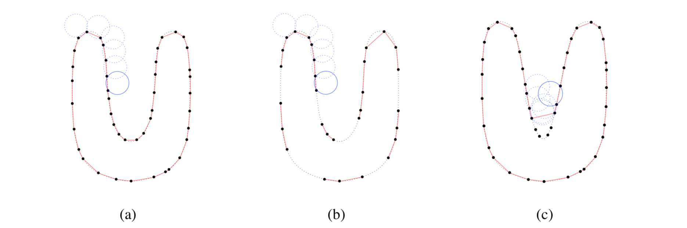
        <figcaption align="middle">differing p values and effects</figcaption>
</div>

We experienced some slight difficulty with implementing a proper $p$ estimator, and while it works well with some meshes, the more variation in the distribution of points from the sampled surface the more room for possible error. In some cases, the distance between points is so varied, that there are some portions of the mesh that cannot be reached by the ball pivoting. This leaves many holes in the mesh, particularly in regions where the points are spread apart. Increasing $p$ to be too large would also have effects.

<div align="middle">
        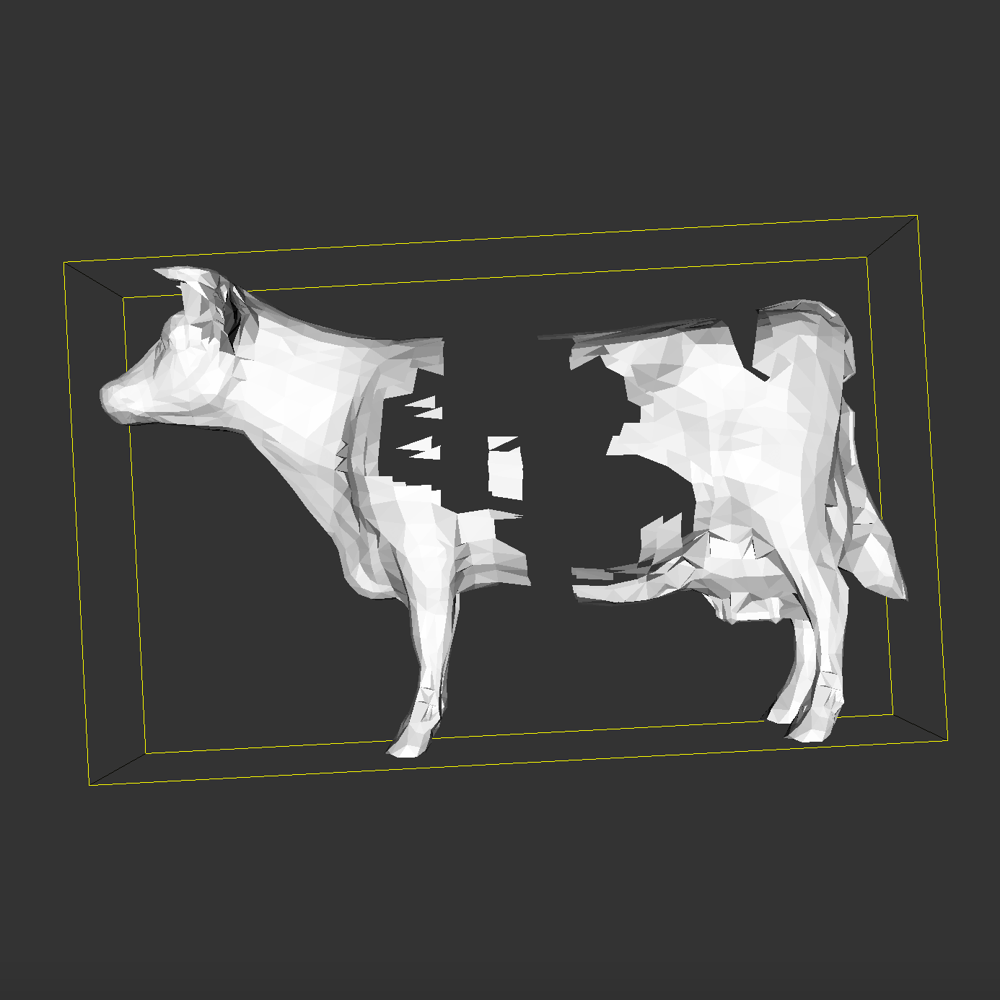
        <figcaption align="middle">example of (b) occurring</figcaption>
</div>

In some cases the estimated value of $p$ is not fine enough to account for cases like (c) in the image above:

<div align="middle">
        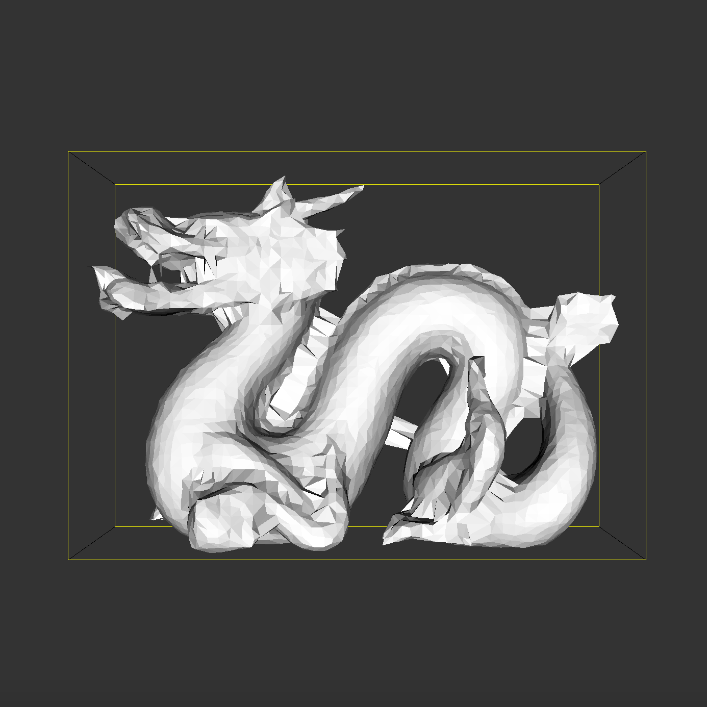
        <figcaption align="middle">example of (c) occurring</figcaption>
</div>

We mostly remedied this by empirical observation and manual tweaking of $p$ values on a mesh-by-mesh basis. Given more time, we would extend the algorithm to go through multiple passes with varying sizes of $p$ to deal with finer detail before connecting spread parts of the point cloud.

## Lessons Learned

Implementing BPA came with challenges. The visual algorithm was at some times tricky to implement, and it was important for us to visualize and draw out the algorithm. By working together to understand the multiple components of BPA and drawing things out, and reading the papers in a focused manner we were able to get a quite good working version of the BPA algorithm.

Some skills gained were: working with external libraries, sifting through documentation, reading and understanding high-level implementations described in papers, etc. 

I believe we all realize now that it is more difficult to implement an algorithm even if it is conceptually easy to understand. It was great being able to implement a semi-large-scale project that involved keeping track of many facets such as vertices and edges. 

One of the most important lessons we learned was the importance of good design. Initially we designed our mesh and our data-structures in a rigid and inflexible way that didn't allow us to implement the algorithm efficiently and correctly. Had we designed the program better from the start we would have saved time and effort.

## Results

We believed that being able to visualize the algorithm was an important aspect of our project. You can see a video containing visualizations here. Below are two animated images of the construction of simple meshes using BPA, notice how the mesh expands from a seeded triangle. 

<div align="middle">
        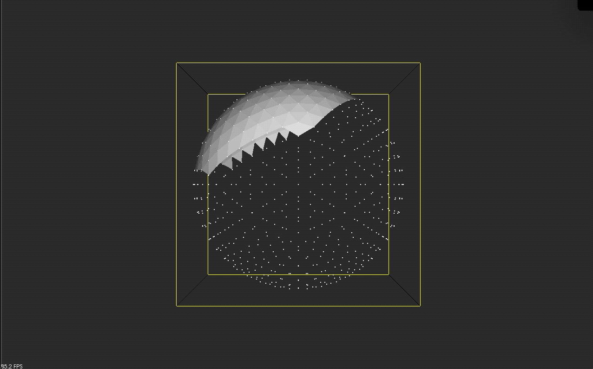
        <figcaption align="middle">visualization of BPA using sphere.ply</figcaption>
</div>

<div align="middle">
        
        <figcaption align="middle">visualization of BPA using fuze.ply</figcaption>
</div>

Unfotunately, for large meshes the visualizer gets too slow as the visualizer has a hard time redering many triangles, however the final meshes can be displayed in a single frame after about 30 seconds to 1 minute of BPA (bar high resolution dragon). Below are results of running our algorithm:

<div align="middle">
        
        <figcaption align="middle">bunny.ply using our BPA</figcaption>
</div>

<div align="middle">
        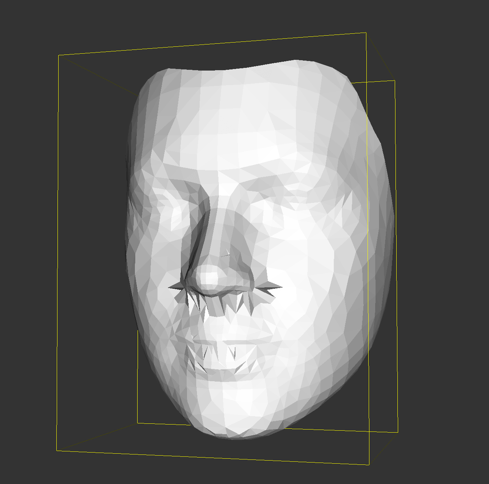
        <figcaption align="middle">reference.ply using our BPA</figcaption>
</div>

<div align="middle">
        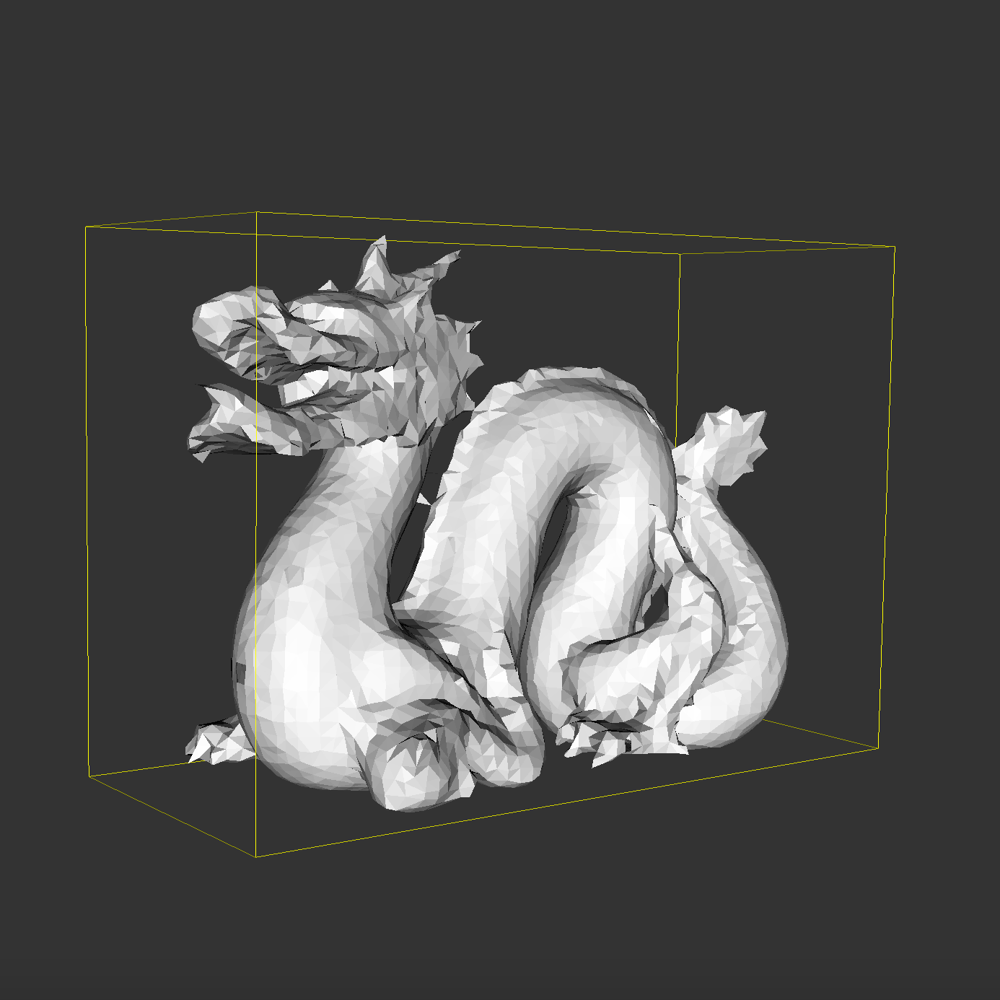
        <figcaption align="middle">dragon.ply with low PC resolution using our BPA</figcaption>
</div>

<div align="middle">
        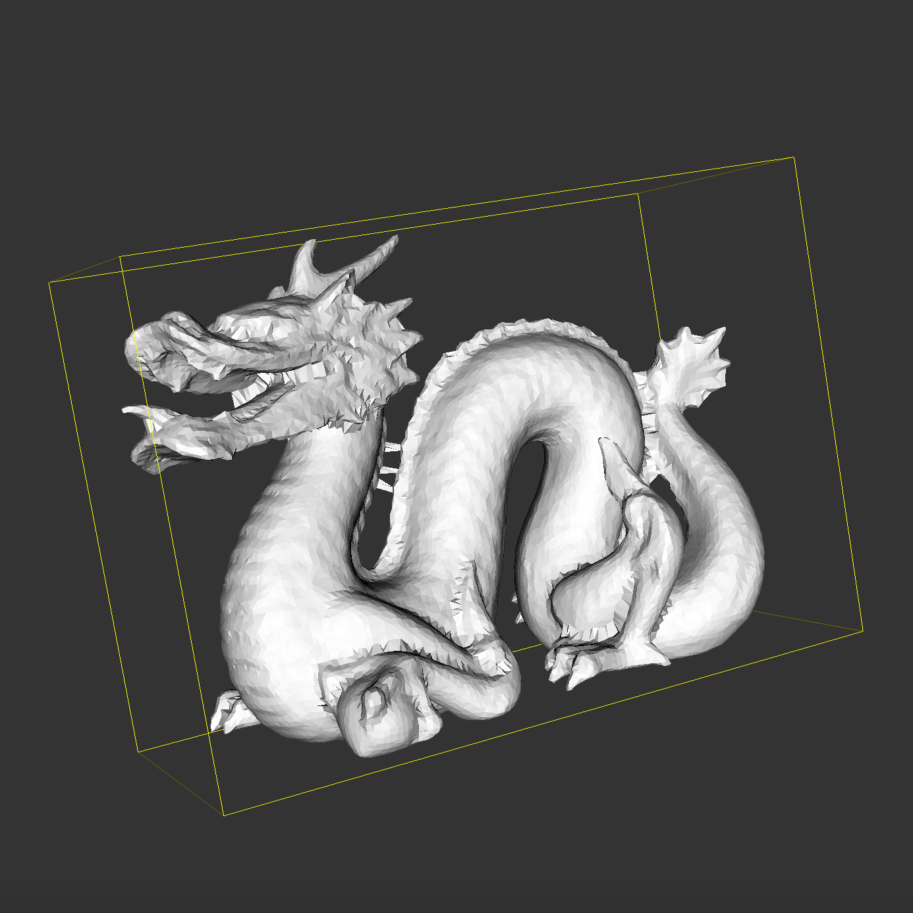
        <figcaption align="middle">dragon.ply with high PC resolution using our BPA</figcaption>
</div>


## References


## Contributions

**Project Proposal:** John Rush, Martin Xia, Griffin Prechter

**Milestone (Normal Estimation):** Griffin Prechter, John Rush

**BPA Implementation & Visualization:** Griffin Prechter, Martin Xia

**Presentaiton & Demo:** Griffin Prechter, John Rush

**Final Report:** Griffin Prechter, John Rush

**Final Video:** Griffin Prechter

#### By Member

## Appendix

### Classes & Data Structures

```cpp
class Vertex {
  public:
    bool used; /* Wether or not this Vertex is included in the mesh. */
    pcl::PointXYZ pos; /* Position of Vertex in space. */
    pcl::Normal normal; /* The estimated surface normal of this vertex. */
    pcl::PointXYZ *voxelPos(); /* Determine the voxel this vertex is within. */
    std::string to_string(); /* String representation of vertex. */
    std::vector<Vertex*> *edges; /* Edges attached to this point, represented by vertices 																			this point is asjacent to. */
};
```

The `Vertex` class is used to represent the points in the point cloud. Each vertex includes important information used by BPA.

```cpp
class Edge {
  public:
    Vertex *v_i; /* One of the edge's vertices. */
    Vertex *v_j; /* One of the edge's vertices. */
    Vertex *v_o; /* The vertex opposite to this edge in the triangle. */
    pcl::PointXYZ c; /* The center of the ball that rests on this edge's triangle. */
};
```

The `Edge` class is used to represent the edges of the reconstructed mesh. These edges will lie on the `Front`, which is used to discover new triangles to be added to the mesh during BPA.

```cpp
class Triangle {
  public:
    std::vector<Vertex*> points; /* Vertices that make up the triangle. */
};
```

The `Triangle` class represents a triangle in the mesh.

```cpp
class Voxel {
  public:
    pcl::PointXYZ origin; /* The origin of this voxel. */
    std::vector<Vertex*> *vertices; /* Vertices in this Voxel. */
};
class VoxelGrid {
  public:
    int num_x; /* x-dimension of voxels. */
    int num_y; /* y-dimension of voxels. */
    int num_z; /* z-dimension of voxels. */
    std::vector<Voxel*> voxels; /* Voxels in the grid. */
    std::vector<Voxel*> *findNeighboringVoxels(int x_p, int y_p, int z_p);
    Voxel *findVoxel(int x, int y, int z); /* Voxel from xyz coordinates. */
    std::vector<Vertex*> *findNeighborhood(Vertex *v); /* Find vertices in neighboring 27 																														voxels. */
};
```

The `Voxel` and `VoxelGrid` class make up the 3D Voxel Grid spatial partitioning of vertices for efficient lookup of a point's nearby points.

```cpp
class Front {
  public:
    std::vector<Edge*> *front; /* List of edges on Front. */
    bool onFront(Vertex *x); /* Checks if vertex 'x' is in an edge on the Front. */
    void join(Edge *e, Vertex *x, pcl::PointXYZ *cent); 
  	/* add triangle with 'e' and 'x' to the front, where the p-ball has center 'cent'. */
};
```

The `Front` class maintains the list of edges that can be pivoted over.